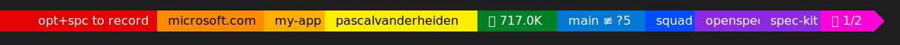

# TUI Custom Prompt

A rainbow-flag Oh-My-Posh terminal prompt for macOS, Linux and Windows.



Segments only render when their tool is installed or their project marker is
present in the current folder — otherwise they stay hidden.

## Install

1. **Install Oh-My-Posh + a Nerd Font** (see [tools table](#tools-per-segment)).
2. **Clone & run the installer**:

   macOS / Linux:
   ```bash
   git clone https://github.com/pascalvanderheiden/tui-custom-prompt.git
   cd tui-custom-prompt
   ./install.sh
   ```
   Windows (PowerShell):
   ```powershell
   git clone https://github.com/pascalvanderheiden/tui-custom-prompt.git
   cd tui-custom-prompt
   .\install.ps1
   ```
3. **Open a new terminal.** Done.

Set your terminal font to a Nerd Font (e.g. `MesloLGM NF`) so glyphs render.

## Tools per segment

| Segment              | macOS                                                                                                  | Windows                                                                                                |
| -------------------- | ------------------------------------------------------------------------------------------------------ | ------------------------------------------------------------------------------------------------------ |
| Oh-My-Posh *(req.)*  | `brew install jandedobbeleer/oh-my-posh/oh-my-posh`                                                    | `winget install JanDeDobbeleer.OhMyPosh -s winget`                                                     |
| Nerd Font *(req.)*   | `brew install --cask font-meslo-lg-nerd-font`                                                          | `winget install DEVCOM.JetBrainsMonoNerdFont`                                                          |
| 🟠 Azure             | `brew install azure-cli` · `az login`                                                                  | `winget install Microsoft.AzureCLI` · `az login`                                                       |
| 🟡 GitHub user       | `brew install gh` · `gh auth login`                                                                    | `winget install GitHub.cli` · `gh auth login`                                                          |
| 🟢 Tokens (last 30d) | `npm i -g @microsoft/ai-engineering-fluency` *(internal)*                                              | `npm i -g @microsoft/ai-engineering-fluency` *(internal)*                                              |
| 🔷 Git               | preinstalled / `brew install git`                                                                      | `winget install Git.Git`                                                                               |
| 🔵 Squad             | `npm i -g @bradygaster/squad-cli` (needs `.squad` marker in project)                                   | `npm i -g @bradygaster/squad-cli` (needs `.squad` marker in project)                                   |
| 🟣 OpenSpec          | `brew install node jq` · `npm i -g @fission-codes/openspec`                                            | `winget install OpenJS.NodeJS jqlang.jq` · `npm i -g @fission-codes/openspec`                          |
| 🟣 Spec Kit          | `brew install uv` · `uv tool install specify-cli --from git+https://github.com/github/spec-kit.git`    | `winget install astral-sh.uv` · `uv tool install specify-cli --from git+https://github.com/github/spec-kit.git` |
| 🩷 Colima            | `brew install colima docker` · `colima start`                                                          | not supported — use Docker Desktop / WSL2                                                              |

## Files

| File                   | Purpose                                  |
| ---------------------- | ---------------------------------------- |
| `rainbowflag.omp.json` | Oh-My-Posh theme                         |
| `scripts/*.sh`         | Segment helpers (edit to customize)      |
| `install.sh`           | Installer for macOS / Linux              |
| `install.ps1`          | Installer for Windows                    |
